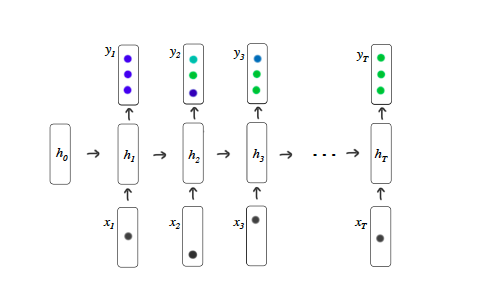
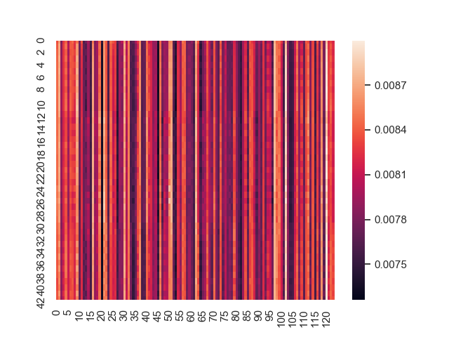

# Deep Knowledge Tracing

This is my PyTorch implementation of the paper, [Deep Knowledge Tracing](http://stanford.edu/~cpiech/bio/papers/deepKnowledgeTracing.pdf) by Chris Pieth et al. The official code for the paper in Lua is available [here](https://github.com/chrispiech/DeepKnowledgeTracing) 

### Knowledge Tracing

Tha task of knowledge tracing, where machine models the knowledge of a student as they interact with the coursework, is a well established problem in computer supported education. This paper solves the problem using a sequential model comprised of LSTMs.

The task of knowledge tracing is formally defined as : given a set of interactions x0, ..., xt, taken by a student on a particular learning task, we need to predict the aspects of their next interaction x(t+1).

### Model

The model is comprised of a single layer unidirectional LSTM cells which compute an output sequence of vectors for the input sequence of questions answered by the student.
The model architecture as illustrated in the paper is : 

The inputs (x1, ..., xt), to the network are either one-hot encodings or compressed representations of a student action, and the prediction (yt) is a vector representing the probability of getting each of the dataset exercises correct.

###  Implementation details

For implementing the model, the Binary Cross Entropy loss has been calculated and the Stochastic Gradient Descent algorithm has been used. The model is evaluated using the RMSE and AUC metric after every 100 training steps, taking a batch size of 32 training examples. The complete set of hyperparameters can be found in args.py. 

### Datasets

The following benchmark dataset as given in the paper is used and is available on the repo.

> Assistments 2009-2010 “skill builder” public benchmark dataset2.

### Results

The model was trained for 20 epochs on the Benchmark training dataset and the following prediction distribution over the student skills at each for every question were obtained :

### TODO
The batch-wise padding needs to be performed in order to improve the efficiency.
The evaluation function is a naive implementation of calculation of RMSE and AUC metric. The implementation should be improved to utilize the power of parallelization.

I would love to incorporate any feedback on the implementation.

### Acknowledgement
I would like to thank Michael Beeler for introducing me to this exciting area of EdTech and would love to contribute to this field more.
I also seeked reference from [this](https://github.com/dxywill/deepknowledgetracing) implementation.
